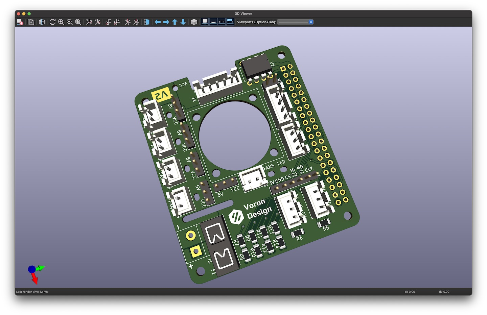

# Klipper Fan Hat

[Interactive bom](https://mikethomas.info/Klipper-Fan-Hat)

### A Hat to use with the [Raspberry Pi as a Secondary MCU in Klipper](https://www.klipper3d.org/RPi_microcontroller.html):
- SKR Pico compatible input for powering the Pi and Serial communication
- 5 Mosfet outputs (with 2 pin JST-XH connectors standard on most fans used on 3D printers)
- Voltage selector jumpers to power each fan from either 5V or VCC supplied by screw terminal
- I2C and 1-Wire and SPI headers for connecting accesories to the Raspberry Pi
- 2 headers connected to General Purpose GPIO pins for accesories such as Filament Run Out Sensors

### Documentation

[Documentation and Setup information here](Documentation/README.md)

 Parts that I sourced for assembly:
- 1206 Capacitor Set [Ali Express](https://www.aliexpress.com/item/1005002907508304.html)
- 1206 LEDs [Ali Express](https://www.aliexpress.com/item/1005003836509392.html)
- 1206 Resistor Set [Ali Express](https://www.aliexpress.com/item/33029877427.html)
- 2510 Axial Fan [Ali Express](https://www.aliexpress.com/item/32807610078.html)
- Blade Fuse Holder [Ali Express](https://www.aliexpress.com/item/1005003194700697.html)
- DIP-8 24C32 EEPROM [Ali Express](https://www.aliexpress.com/item/33036366759.html)
- DIP-8 Socket [Ali Express](https://www.aliexpress.com/item/1005001650813894.html)
- IRLML6344TRPBF Mosfets [Ali Express](https://www.aliexpress.com/item/1005004711783484.html)
- JST-XH Connector Set [Ali Express](https://www.aliexpress.com/item/33000442968.html)
- Jumper Caps [Ali Express](https://www.aliexpress.com/item/1005004482029258.html)
- KF301 Screw Terminal [Ali Express](https://www.aliexpress.com/item/1005003311688833.html)
- M2.5x14 BHCS [Ali Express](https://www.aliexpress.com/item/1005004123548619.html)
- Pin Header Set [Amazon](https://www.amazon.co.uk/gp/product/B07CWSXY7P)
- Raspberry Pi Headers and Spacers [Amazon](https://www.amazon.co.uk/gp/product/B07PHBTTGV)
